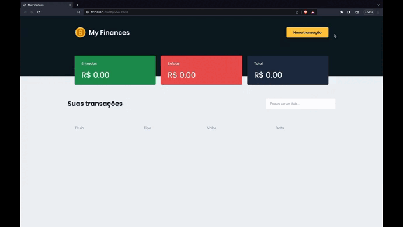

# 💰 My Finances

✅ Projeto concluído

<a href="#breve-descrição">Breve Descrição</a> •
<a href="#tecnologias-utilizadas-na-construção-do-projeto">Tecnologias</a> •
<a href="#funcionalidades-do-projeto">Funcionalidades</a> •
<a href="#conceitos-explorados-no-projeto">Conceitos Explorados</a>

## Breve descrição

O projeto tem por objetivo auxiliar o usuário no registro e acompanhamento de suas finanças.

## Tecnologias utilizadas na construção do projeto

📍 HTML  
📍 SCSS (Compilado para CSS por meio da extensão Live Sass Compiler)  
📍 JavaScript

## Funcionalidades do projeto

<strong>Aplicação de página única com os seguintes recursos:</strong>

📍 Modal para o registro de uma transação, em que é possível registrar um nome para a transação, um tipo para a transação (saída ou entrada), o valor da transação, e a data da transação.  
📍 3 cards que mostram para o usuário: o seu total de entradas monetárias em real, o seu total de saídas monetárias em real, e a diferença entre o total de entradas e o total de saídas.  
📍 Um input de filtro em que é possível procurar uma transação pelo título/nome.  
📍 Uma tabela que mostra para o usuário o título, o tipo, o valor, e a data da transação, além de um botão que permite deletar a transação.  
📍 Ao clicar no botão para deletar uma transação, o usuário recebe uma mensagem que solicita uma confirmação a fim de evitar erros por parte do usuário.  
📍 É importante mencionar que há persistência dos dados na aplicação, mesmo que o usuário recarregue a página, os dados ficam salvos.

### Responsividade:

## Conceitos explorados no projeto

📍 Programação orientada a eventos por meio do addEventListener.  
📍 Alteração de estilos por meio do JavaScript.  
📍 Uso de métodos para manipulação de arrays.  
📍 Armazenamento e manipulação de dados no Local Storage.  
📍 Funções de alta ordem (filter, find, forEach).
